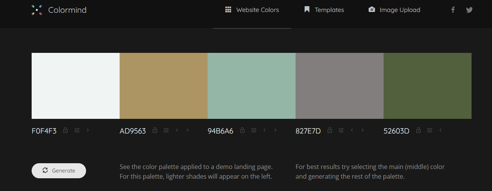
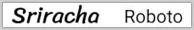
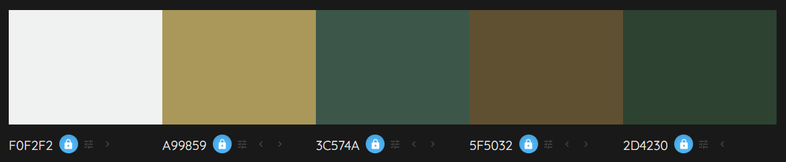
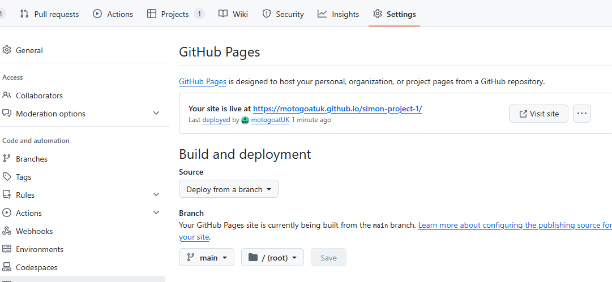
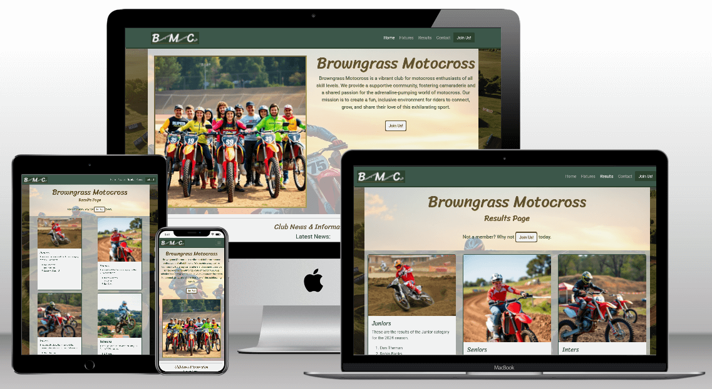

# simon-project-1
A user centric project built using HTML and CSS with Git for version control.  
The repository for this project is at [https://github.com/motogoatuk/simon-project-1](https://github.com/motogoatuk/simon-project-1)
# Sports website - Browngrass Motocross
A fictional motocross club is requesting a website to fulfill their needs.
## Strategy
### Business goals:
- Increase awareness of our club
- Attract new members
- Increase attendance at race meetings (events)
- Provide News & Information to existing members
### Users:
Users of the website include Spectators, riders (members) and supporters
### User goals:
- Find events (fixture list)
- See previous results
- Find club news & information
- Become a member of the club
- Book into race events
## Scope and Structure
### Project board
The project board contains all the **user stories** which have been assigned labels for must-have, should-have, could-have (MSC), based on the above goals and project constraints.

The project board can be viewed here: [User centric project1](https://github.com/users/motogoatuk/projects/4)  
The website will consist of a homepage with News and contact details, a fixtures list, results page and a membership application form.

Provision of a members event online booking system will be held back for a future version.

## Skeleton
Basic Wireframes for each page were drawn up and exported to [this PDF file](assets/browngrass-wireframes-1.pdf)

Homepage example: 
## Surface
### Colours:
The colour scheme was generated from [colormind.io](colormind.io) and has shades of green and brown to represent the earthy tones of an off-road race track.  




### Typography
The fonts chosen for this project are **Sriracha** as the display font, for it's active look, paired with **Roboto** as an easy to read, sans-serif font: 
  

## Development environment and technologies used
- Visual Studio Code (VSC) by Microsoft.     
- Git & GitHub: For version control, project management and deployment.
- Firefox browser: for initial testing and development using Firefox developer tools.
- Bootstrap: For responsive layouts, grids and nav components.
- HTML5: Semantic and accessible markup.
- CSS3: Clean layout and responsive design.

## Issues Encountered
The suggested colour palette was tested for contrast using the contrast checker at [https://webaim.org/](https://webaim.org/resources/contrastchecker/) but failed accessibility checks. I manually adjusted the luminosity of some of the previously generated colours to attain the correct contrast levels and pass the WCAG AAA checks.
| variable name | old colour (hex) | new colour 
| --- | --- | --- |
| shades-light  | #f0f4f3 | #f0f2f2 
| accent-light	| #ad9563 | #a99859
| main-brand	| #94b6a6 | #3c574a
| accent-dark	| #827e7d | #5f5032
| shades-dark	| #52603d | #2d4230

#### New colour chart
  

<hr>

I spent some time trying to centre the fixed width cards on the results page where the content was single column (see left pic below).  
I had tried justify-align mx-auto on all the containers to no avail. The nature of the flex containers is to stretch across the allowed column space so fixing the width caused the issue. In the end I managed to keep a fixed width and keep the card centered by changing the card class instruction ```margin-bottom: 1.5rem;``` to ```margin: 0 auto 1.5rem;```  


<hr>

### Bugs discovered during testing:  
When clicking on the address box the cursor appeared at a seemingly random location as shown below.


This was caused by formatting in the join-us.html file and was resolved by closing the ```<textarea>``` tag before the newline.

<hr>

The "Agree to Terms" checkbox on the join-us form was out of alignment. Adding the bootstrap classes form-check and form-check-input brought them onto the correct line and a left margin was added to line the checkbox up with the other input boxes on wider screens.

<hr>

After testing and getting a CSS3 badge to display, I added it to each footer and committed the changes. I then realised the supplied badge code contained an external link, so I had to add in the _blank target and noreferer options. Upon committing these changes and testing it was found that the links didn't work as intended so I removed the noreferer option and re-tested. This also failed to work so I decided to rollback the changes using git reset. I then modified the links to work satisfactorily.

<hr>

Following user testing it was decided an email field would be needed on the membership application form, also the checkbox for the terms and conditions was difficult to see.  
An email field was then added to the user form and the colours of the field borders overridden with some css to match the sites colour palette.  
These changes were checked via the W3C validator and tested for responsiveness and then the updates were deployed. The following additional unit testing was done on the form: 

| Test Case | Expected Outcome | Actual Outcome | Pass/Fail |
|-----------|----------------|---------------|----------| 
| form submission with a blank email address | Error appears near email field, form not submitted | Error shown near email field, form not submitted | Pass |
| form submission with an invalid email address | Error appears near email field, form not submitted | Error shown near email field, form not submitted | Pass |
| form submission with all required fields filled correctly | Form submits successfully and redirects to the success page | Form submits as expected | Pass |

## Deployment and Testing
Responsive device testing at all stages of development using the terminal command ```python -m http.server -b localhost``` and responsive design mode within Firefox developer tools.

Once deployed, the project was tested using various devices including a laptop and mobile phone. On the desktop, browsers Edge, Chrome and Firefox were used to certify compatibility.  

### W3C testing and results
Failed first test due to having block-level elements inside of ```<p>``` tags. Once these were removed along with adding some missing ```<tr>``` tags in fixtures.html all html files passed validation at [https://validator.w3.org/](https://validator.w3.org/) without errors.  

The styles.css was checked at [https://jigsaw.w3.org/css-validator/](https://jigsaw.w3.org/css-validator/) which it passed as CSS level 3 and issued a badge which I have added to the footer on all pages.


 ### Form testing - Membership application form validation


| Test Case | Expected Outcome | Actual Outcome | Pass/Fail |
|-----------|----------------|---------------|----------|
| form submission with all required fields filled correctly | Form submits successfully and redirects to the success page | Form submits as expected | Pass |
| form submission without entering a name | Error appears near name field, form not submitted | Error appears near name field, form not submitted | Pass |
| form submission without entering an address | Error appears near address field, form not submitted | Error appears near address field, form not submitted | Pass |
| form submission without entering a date of birth | Error appears near date field, form not submitted | Error appears near date field, form not submitted | Pass |
| form submission with an invalid race number | Error appears near number field, form not submitted | Error appears near number field, form not submitted | Pass |
| form submission without entering a race number | No Error appears, form submits successfully | Form submits as expected | Pass |
| form submission without checking the Terms and Conditions box | Error appears near Terms checkbox, form not submitted | Error appears near Terms checkbox, form not submitted | Pass |


### Deployment

The below steps are used to deploy the project to Github pages.
1. Login to github and select the repository **motogoatUK/simon-project-1**
1. From the menu items near the top right select **Settings**
1. Select the **Pages** from the left hand side menu
1. Under *Branch* select **main** branch
1. Select **Save** to confirm  
Once confirmed, GitHub will build and deploy the site. After a few minutes a link should be shown under the **GitHub Pages** section as shown in the image below.  
You may need to refresh the page to see the link. For this project the link is [https://motogoatuk.github.io/simon-project-1](https://motogoatuk.github.io/simon-project-1)  



The project can be worked on locally by cloning the repository  
#### How to Clone a Repository

1. Navigate to the repository [https://github.com/motogoatuk/simon-project-1]
2. Click the Code button and copy the repository URL
3. Open your terminal or Git Bash
4. Change your working directory to where you want the cloned directory to be made
5. Type _git clone_ then paste in the [repository URL] from step 2
6. Press Enter

## Deployed project

#### User story:
As a First-Time Visitor, I need easy navigation and a user-friendly design, including a responsive layout for my device, so I can find information quickly and efficiently without frustration. 
Acceptance Criteria

 - [x] The website is fully responsive across various devices and screen sizes.
 - [x] Site layout and navigation are intuitive, allowing easy access to different sections.
#### User story:
As a spectator I want to find information about upcoming events so that I can plan which events I can attend. 
 - [x] Fixture list in date order added as seperate page
#### User Story:
As a supporter I want to be able to read news on the club website so that I can keep up to date with progress 
 - [x]  News section clearly visible on Homepage
#### User Story:
As a rider I want to join a club so I can take part in events 
 - [x]  Membership form clearly accessible from all pages
 - [x] Membership form responsive on all device sizes
 - [x] Confirmation and further information after submitting form
#### User story:
As a riding member I want to see the previous race event results so that I can see where I placed and can plan my next race strategy.
  - [x] Results page with results laid out clearly and responsively

## Credits
Code snippets used from [getbootstrap.com](https://getbootstrap.com/docs/5.3/):
- Navbar used on all pages
- Card sections used on results page 

[Font Awesome](https://fontawesome.com): For the social media and address icons in the footer.  
This section was initially adapted from the **Code Institute _Boardwalk Games_ Online Tutorials**  

Fonts were sourced from [Google Fonts](https://fonts.google.com)  

png images optimised by [TinyPNG](https://tinypng.com)  

Mock-up created at [https://techsini.com/multi-mockup/](https://techsini.com/multi-mockup/)

AI images created with [Gemini AI](https://gemini.google.com/) using prompts such as _"Create a photorealistic or stylized image in 4K resolution of a motocross track, viewed from above. The composition should be balanced and friendly. The color palette should be bright and positive, conveying enthusiasm and energy. The environment should be a motocross track or a related outdoor rural setting. The camera angle should be from above. Add natural lighting to create a warm and inviting atmosphere."_  

---
---
