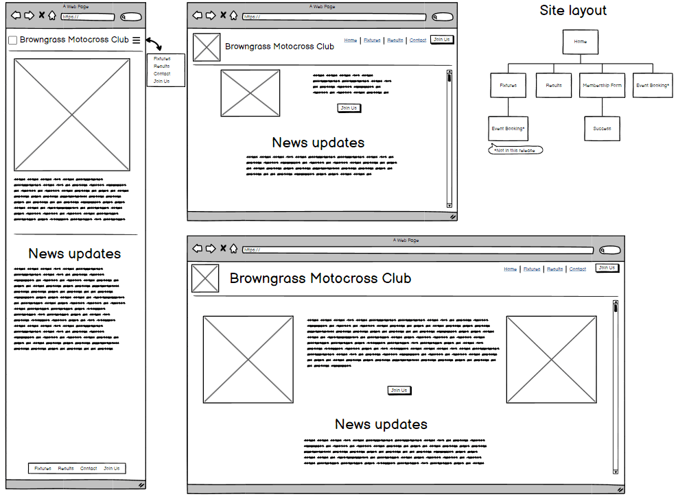
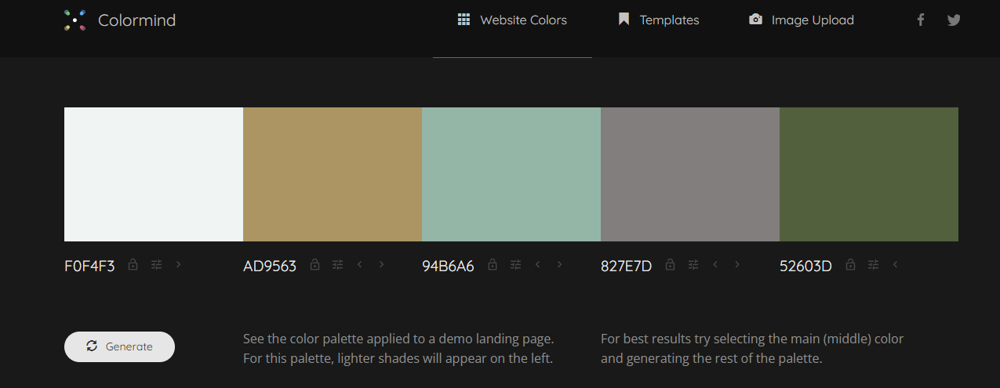
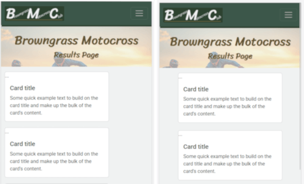
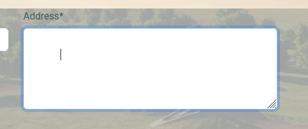

# simon-project-1
A user centric project built using HTML and CSS
# Sports website - Browngrass Motocross
A fictional motocross club is requesting a website to fulfill their needs.
## Strategy
### Business goals:
- Increase awareness of our club
- Attract new members
- Increase attendance at race meetings (events)
- Provide News & Information to existing members
### Users:
Users of the website include Spectators, riders (members) and supporters
### User goals:
- Find events (fixture list)
- See previous results
- Find club news & information
- Become a member of the club
- Book into race events
## Scope and Structure
### Project board
Contains all the user stories which have been assigned labels for must-have, should-have, could-have (MSC), based on the above goals and project constraints.

The project board can be viewed here: [User centric project1](https://github.com/users/motogoatUK/projects/4)  
The website will consist of a homepage with News and contact details, a fixtures list, results page and a membership application form.

Provision of a members event online booking system will be held back for a future version.

## Skeleton
Basic Wireframes for each page were drawn up and exported to [this PDF file](assets/browngrass-wireframes-1.pdf)

Homepage example: 
## Surface
### Colours:
The colour scheme was generated from [colormind.io](colormind.io) and has shades of green and brown to represent the earthy tones of an off-road race track.  




### Typography
The fonts chosen for this project are Sriracha as the display font, chosen for it's active look, paired with Roboto as an easy to read sans-serif font.

## Issues Encountered
The suggested colour palette was tested for contrast using the contrast checker at [https://webaim.org/](https://webaim.org/resources/contrastchecker/) but failed accessibility checks. I manually adjusted the luminosity of some of the previously generated colours to attain the correct contrast levels and pass the WCAG AAA checks.
| variable name | old colour (hex) | new colour 
| --- | --- | --- |
| shades-light  | #f0f4f3 | #f0f2f2 
| accent-light	| #ad9563 | #a99859
| main-brand	| #94b6a6 | #3c574a
| accent-dark	| #827e7d | #5f5032
| shades-dark	| #52603d | #204230

<hr>

I spent some time trying to centre the fixed width cards on the results page where the content was single column (see left pic below).  
I had tried justify-align mx-auto on all the containers to no avail. The nature of the flex containers is to stretch across the allowed column space so fixing the width caused the issue. In the end I managed to keep a fixed width and keep the card centered by changing the card class instruction ```margin-bottom: 1.5rem;``` to ```margin: 0 auto 1.5rem;```  


<hr>

### Bugs discovered during testing:  
When clicking on the address box the cursor appeared at a seemingly random location as shown below.



This was caused by formatting in the join-us.html file and was resolved by closing the ```<textarea>``` tag before the newline.

<hr>

The "Agree to Terms" checkbox on the join-us form was out of alignment. Adding the bootstrap classes form-check and form-check-input brought them onto the correct line and a left margin was added to line the checkbox up with the other input boxes on wider screens.

## Testing
Responsive device testing at all stages of development using the terminal command ```python -m http.server -b localhost``` and responsive design mode within Firefox developer tools.

Once deployed, the project was tested using various devices including a laptop and mobile phone. On the desktop, browsers Edge, Chrome and Firefox were used to certify compatibility.

## Deployment

The below steps are used to deploy the project to Github pages.
1. login to github and select the repository **motogoatUK/simon-project-1**
2. From the menu items near the top right select **Settings**
3. Select the **Pages** from the left hand side menu
1. Under *Branch* select **main** branch
1. Select **Save** to confirm  
Once confirmed, GitHub will build and deploy the site. After a few minutes a link should be shown under the **GitHub Pages** section as shown in the image below.  
You may need to refresh the page to see it. For this project the link is [https://motogoatUK.github.io/simon-project-1]

### W3C testing and results
Failed first test due to having block-level elements inside of ```<p>``` tags. Once these were removed along with adding some missing ```<tr>``` tags in fixtures.html all html files passed validation at [https://validator.w3.org/] without errors.  

The styles.css was checked at [https://jigsaw.w3.org/css-validator/] which it passed as CSS level 3 and issued a badge which I have added to the footer on all pages.

## Credits
Code snippets used from [getbootstrap.com](https://getbootstrap.com/docs/5.3/):
- Navbar used on all pages
- Card sections used on results page 

png images optimised by [TinyPNG](https://tinypng.com)  

AI images created with [Gemini AI](https://gemini.google.com/) using prompts such as _"Create a photorealistic or stylized image in 4K resolution of a motocross track, viewed from above. The composition should be balanced and friendly. The color palette should be bright and positive, conveying enthusiasm and energy. The environment should be a motocross track or a related outdoor rural setting. The camera angle should be from above. Add natural lighting to create a warm and inviting atmosphere."_

